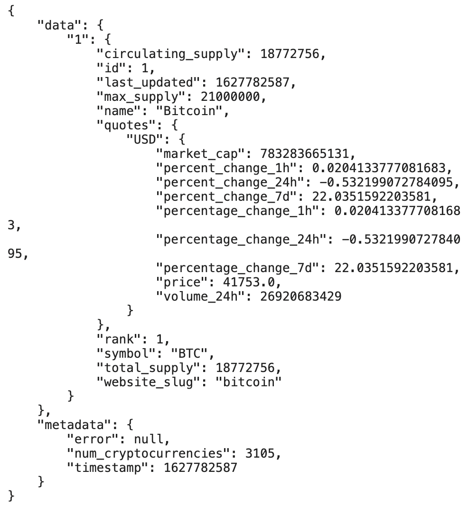
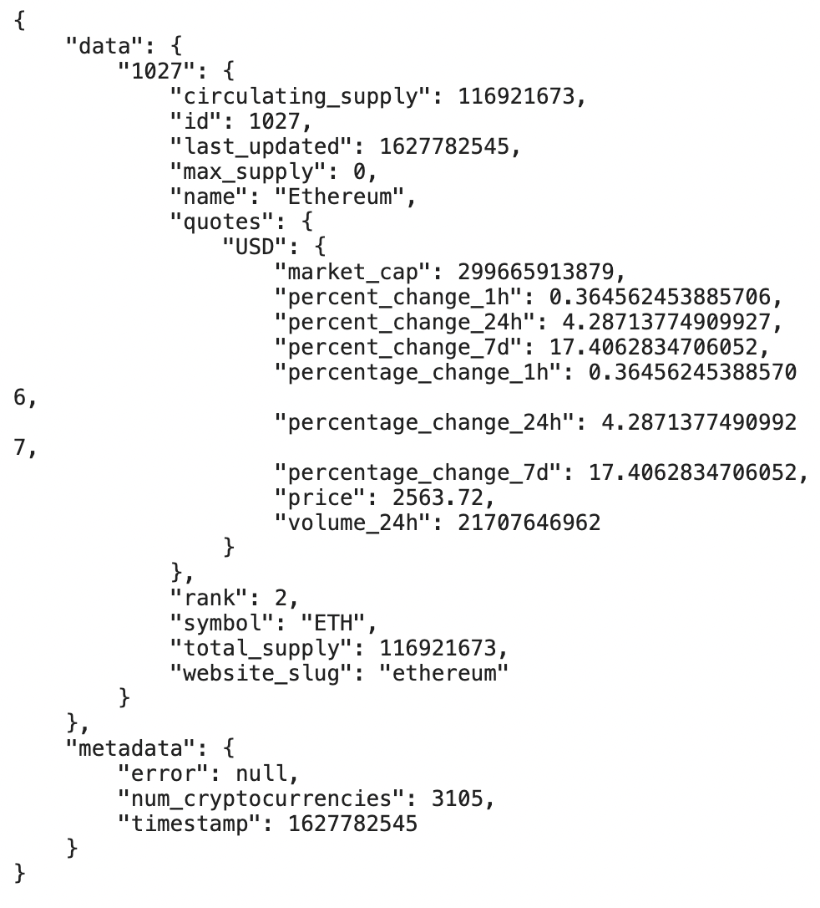
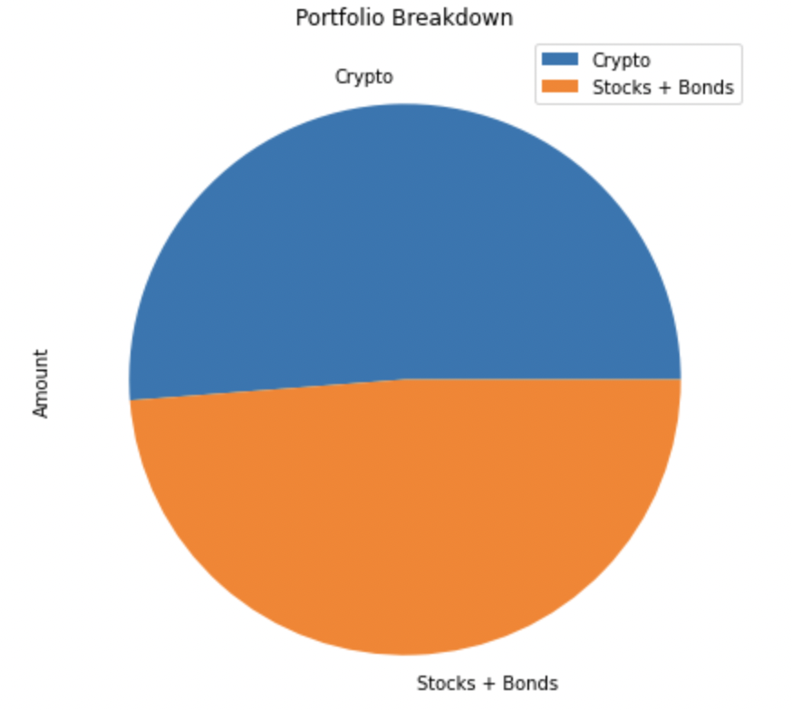
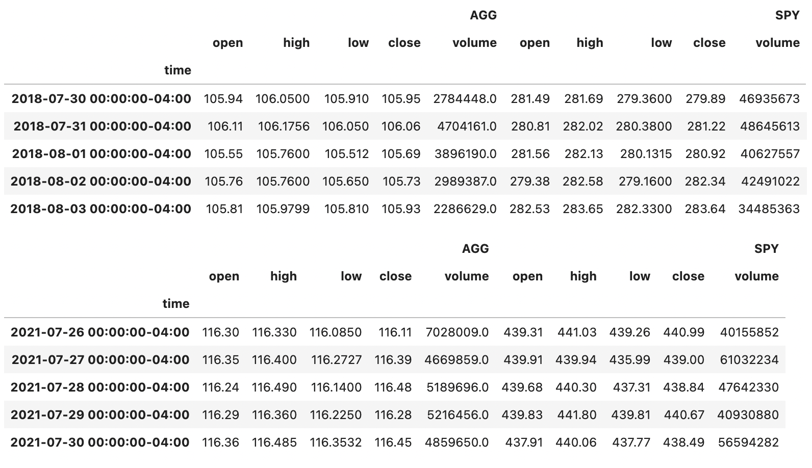
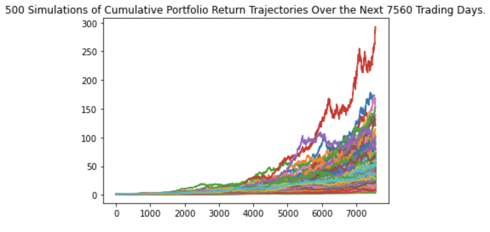
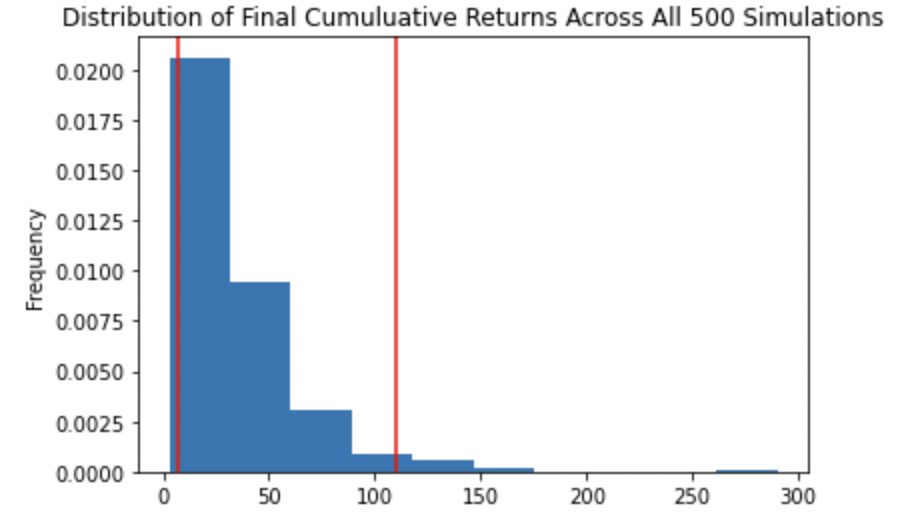
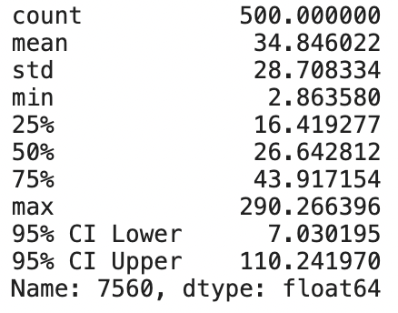

# Financial Planner

Financial Planner is a tool to help users evaluate their financial health. Extended to two seperate tools, the first is a financial planner for emergencies. Users will be able to use this tool to visualize their current savings. Users can then determine if they have enough reserves for an emergency fund. The second tool is a financial planner for retirement. This tool will forecast the performance of a users retirement portfolio in 30 years. To do this, the tool will make an Alpaca API call via the Alpaca SDK to get historical price data for use in Monte Carlo simulations.

---

## Technologies

This project leverages python 3.7 with the following:

* [JupyterLab](https://jupyterlab.readthedocs.io/en/stable/) - JupyterLab is a web-based user interface designed for data analysis.

* [pandas](https://github.com/pandas-dev/pandas) - Flexible and powerful data analysis / manipulation library for Python.

* [dotenv](https://pypi.org/project/python-dotenv/) - Python-dotenv reads key-value pairs from a .env file and can set them as environment variables.

* [alpaca-trade-api](https://pypi.org/project/alpaca-trade-api/) - alpaca-trade-api-python is a python library for the Alpaca Commission Free Trading API. It allows rapid trading algo development easily, with support for both REST and streaming data interfaces.

* [matplotlib inline](https://github.com/matplotlib/matplotlib) - Comprehensive library for creating static, animated, and interactive visualizations in Python.

---

### Installation Guide

Before running the application first install the following dependencies.

```python
  pip install jupyterlab
  pip install pandas
  pip install dotenv
  pip install alpaca-trade-api
  pip install matplotlib
```

---

## Examples

**Using the Requests library to get the current price (in US dollars) of Bitcoin (BTC) and Ethereum (ETH) by using API endpoints. Navigating the JSON response object to access the current price of each coin, and storing each in a variable.**
```
btc_url = "https://api.alternative.me/v2/ticker/Bitcoin/?convert=USD"
eth_url = "https://api.alternative.me/v2/ticker/Ethereum/?convert=USD"

btc_response = requests.get(btc_url).json()

print(json.dumps(btc_response, indent=4, sort_keys=True))

eth_response = requests.get(eth_url).json()

print(json.dumps(eth_response, indent=4, sort_keys=True))

btc_price = btc_response['data']['1']['quotes']['USD']['price']

print(f"The price of Bitcoin is {btc_price}")

eth_price = eth_response['data']['1027']['quotes']['USD']['price']

print(f"The price of Ethereum is {eth_price}")

```
**Setting the variables for the Alpaca API and secret keys.**
```
# Setting the variables for the Alpaca API and secret keys.
alpaca_api_key = os.getenv("ALPACA_API_KEY")
alpaca_secret_key = os.getenv("ALPACA_SECRET_KEY")

# Checking that the values were imported correctly by evaluating the type.
display(type(alpaca_api_key))
display(type(alpaca_secret_key))

# Creating the Alpaca tradeapi.REST object.
alpaca = tradeapi.REST(
    alpaca_api_key,
    alpaca_secret_key,
    api_version="v2")

```

**Creating a Python list named savings_data that has two elements. The first element contains the total value of the cryptocurrency wallet. The second element contains the total value of the stock and bond portions of the portfolio. The savings_data list is used to create a Pandas DataFrame named savings_df, and then displaying this DataFrame. Using the savings_df DataFrame to plot a pie chart that visualizes the composition of the member’s portfolio.**
```
savings_data = [total_crypto_wallet,total_stocks_bonds]

savings_data

savings_df = pd.DataFrame(savings_data, index=["Crypto", "Stocks + Bonds"], columns=['Amount'])

savings_df.head()

savings_df.plot.pie(figsize=(10,7), y='Amount', title='Portfolio Breakdown')

```

**Visualizing the cumulative return data of the Four Fund Portfolios and the S&P 500 using Pandas plot function.**
```
cumulative_returns.plot(figsize=(10,5), title="Cumulative Returns of Funds and S&P 500: 2014-2020")

```

**Creating a series of three if statements to determine if the member’s total portfolio is large enough to fund the emergency portfolio:**
```
if (total_portfolio > emergency_fund_value):
    print("Congratulations! You have more than enough money in your fund!")
elif (total_portfolio == emergency_fund_value):
    print("Congratulations! You have reached an important financial goal!")
elif (total_portfolio < emergency_fund_value):
    print(f"You are {emergency_fund_value == total_portfolio: ,.2f} away from reaching the goal!")

```

**Making an API call via the Alpaca SDK to get 3 years of historical closing prices for a traditional 60/40 portfolio split: 60% stocks (SPY) and 40% bonds (AGG).**
```
start_date = pd.Timestamp("2018-07-30", tz="America/New_York").isoformat()
end_date = pd.Timestamp("2021-07-30", tz="America/New_York").isoformat()

limit_rows = 1000

portfolio_df = alpaca.get_barset(
    tickers,
    timeframe,
    start=start_date,
    end=end_date,
    limit=limit_rows
).df

display(portfolio_df.head())
display(portfolio_df.tail())
```

**Running a Monte Carlo simulation of 500 samples and 30 years for the 60/40 portfolio, and plotting the results.**
```
MC_stocks_bonds_30y = MCSimulation(
    portfolio_data = portfolio_df,
    weights = [.40,.60],
    num_simulation = 500,
    num_trading_days = 252*30
)

MC_stocks_bonds_30y.portfolio_data.head()

```

**Running the Monte Carlo simulation to forecast 30 years cumulative returns.**
```
MC_stocks_bonds_30y.calc_cumulative_return()

```

**Visualizing the 30-year Monte Carlo simulation by creating an overlay line plot.**
```
stocks_bonds_line_plot_30y = MC_stocks_bonds_30y.plot_simulation()

```

**Visualizing the probability distribution of the 30-year Monte Carlo simulation by plotting a histogram.**
```
stocks_bonds_distribution_plot_30y = MC_stocks_bonds_30y.plot_distribution()
```

**Generating the summary statistics for the Monte Carlo simulation.**
```
stocks_bonds_stats_30y = MC_stocks_bonds_30y.summarize_cumulative_return()

print(stocks_bonds_stats_30y)

```

**Analyzing the Retirement Portfolio Forecasts - Using the lower and upper `95%` confidence intervals to calculate the range of the possible outcomes for the current stock/bond portfolio.**
```
ci_lower_cumulative_return_30y = round(stocks_bonds_stats_30y[8] * current_balance)
ci_upper_cumulative_return_30y = round(stocks_bonds_stats_30y[9] * current_balance)

print(f"The expected 30 year value of the portfolio with a 95% confidence interval"
      f" will end within the range of"
      f" {ci_lower_cumulative_return_30y} and {ci_upper_cumulative_return_30y}.")

```

---

## Usage

To use the Financial Planning application simply clone the repository and run the **financial_planning.py** with:

```python
python financial_planning.py
```

Below you will find screenshot demonstrations.















---

## Contributors

Brought to you by Robert Giannini.
LinkedIn: https://www.linkedin.com/in/robertgianninijr/

---

## License

MIT 
